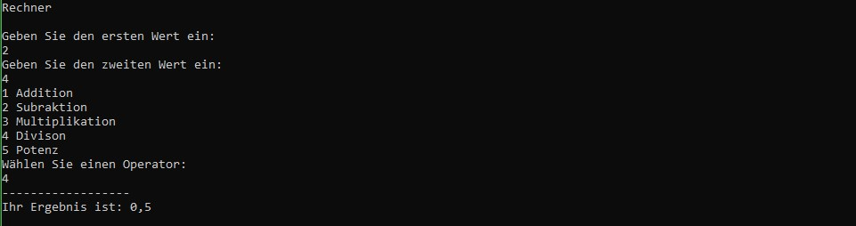

  

        
  

  
 
        <h1>C#-Grundlagen</h1>
        <h3>Arbeitsauftrag zu if-else(if) und switch-case-Anweisungen</h3>

## :dart: Zielsetzung

Dieser Auftrag hat folgende Ziele:

+ Einfache Programmierprobleme nutzen, um die in den Modulen 1, 2, 3 und 4 behandelten Themen zu Vertiefen
+ Üben ein Problem in kleinere Teilprobleme zu zerlegen
+ Üben Informationen zu Recherchieren, die nicht explizit in der Aufgabenstellung genannt werden
+ Üben Sie das Erstellen, Klonen und Einreichen von Aufträgen über Visual Studio 2022 und GitHub

##  :school_satchel: Skills

+ Zerlegung eines Problems in eine Folge einfacher Aufgaben oder Berechnungen
+ Nutzung des Internets, um Informationen oder Formeln zu finden, die zur Lösung von Programmieraufgaben benötigt werden
+ Verwendung von Zuweisungs-Workflow-Schritten

## :bulb: Benötigtes Wissen
+ Konsolenausgabe formatieren und Daten über die Konsole einlesen
+ Verwendung und Konvertierung von Variablen mit unterschiedlichen Datentypen
+ Verarbeitung von Variablen und Literalen durch Operatoren
+ Anweisungen unter verschiedenen Bedingungen

## :bookmark_tabs: Informationsquelle
Das Informationsmaterial zur Aufgabe finden Sie hier:   
[Struktogramme](./AddFiles/SAS_Struktogramm_Info.pdf)   
[Verzweigungen in C#](./AddFiles/SAS_Verzweigungen_Info.pdf)

  
## :white_check_mark: Aufgaben

### Akzeptieren und Klonen von Assignments

Die Links zum Akzeptieren und Klonen von Assignments bekommen Sie von der Lehrkraft.

### Allgemeine Schritte beim Schreiben von Programmen

Die meisten unserer Programme werden dem gleichen allgemeinen Ablauf folgen: Informationen vom Benutzer einlesen, Daten verarbeiten/berechnen, eine Ausgabe erzeugen. Eine Möglichkeit, Ihre Gedanken zu ordnen, besteht darin, **Kommentare zu schreiben**. Verwenden Sie diese als Gliederung für den Code, den Sie schreiben werden. Beginnen Sie mit der Erstellung von Abschnitten für jede der oben genannten Gruppen.

Für jedes Problem müssen Sie die nötigen Schritte zu Eingabe,Verarbeitung und Aufgabe identifizieren und sie in eine Reihenfolge bringen. Schreiben Sie die Schritte als Kommentar auf Deutsch in Ihren Code, bevor Sie programmieren. Wenn Sie das Programm sprachlich nicht umsetzen können, wissen Sie nicht genug, um den Code zu schreiben. 

Bevor Sie den Code schreiben, lesen Sie das Problem und ordnen Sie die Informationen den folgenden Kategorien zu. Tun Sie dies in Kommentaren in Ihrer Codedatei. 

1. **Eingabe** - welche Informationen werden vom Benutzer benötigt? Entwickeln Sie einige Beispieleingaben. Die Eingabefunktion gibt Informationen in Form einer Zeichenkette (Text) zurück. Wenn Sie nach einer Zahl fragen, vergessen Sie nicht, den Text in eine Zahl umzuwandeln, die in nachfolgenden Berechnungen verwendet werden kann. 

2. **Verarbeitung** (Berechnungen) - formeln aufschreiben. Wenden Sie die Beispieleingabewerte von Hand auf Ihre Formeln an, um sie auf ihre Richtigkeit zu überprüfen.

3. **Ausgabe**- was sind die gewünschten Ergebnisse? Liefern Ihre Berechnungen alles, was Sie brauchen? Wenn nicht, gehen Sie  wieder zu Punkt 2.

Erst wenn Sie herausgefunden haben, was Sie tun müssen, beginnen Sie mit dem Schreiben von Code. Beginnen Sie mit dem Abschnitt Eingaben. Schreiben Sie eine Anweisung, die einen Wert vom Benutzer erhält. Sie müssen Variablen erstellen, um die Informationen zu speichern. Verwenden Sie für diese Variablen beschreibende Namen. Geben Sie nach einer Konsoleneingabe den Wert der Eingabe durch eine Konsolenausgabe wieder aus. Führen Sie das Programm zum Testen aus, um sicherzustellen, dass Ihr Code funktioniert. Wenn ja, können Sie die Konsolenausgabe entfernen oder auskommentieren und mit dem nächsten Eingabewert fortfahren. Wenn nicht, müssen Sie Ihren Code korrigieren, bis er funktioniert. Setzen Sie diesen Code- und Testzyklus fort - schreiben Sie eine Zeile Code, dann testen Sie diese.

Sobald Sie alle Eingabewerte haben, fahren Sie mit dem Abschnitt Verarbeitung fort. Möglicherweise müssen Sie zusätzliche Variablen erstellen, um die berechneten Daten zu speichern. Geben Sie diese Berechnungen nach und nach aus. Stimmen sie mit den Handrechnungen überein, die Sie oben gemacht haben? Wenn nicht, korrigieren Sie Ihren Code, um die richtigen Ergebnisse zu erhalten.

Schließlich schreiben Sie die Konsolenausgabe, die die Ausgabe erzeugen. In einem ersten Durchgang geben Sie einfach die gewünschte Ausgabe ein. Gehen Sie dann zurück und fügen Sie die Formatierung hinzu. Um zum Beispiel die Ausgabe in einigen der Beispiele zu erzeugen, müssen Sie möglicherweise Tabulatorzeichen in Ihre Ausgabestrings einfügen.

---

### Aufgabe 1: Die kleinere Zahl

Ein Programm soll den Benutzer nach zwei Zahlen fragen und anschließend das Minimum, also die 
kleinere der beiden Zahlen ausgeben. 

Beispiel 1 Ausgabe/Ergebnis:

Beispiel 2 (Gleicher Wert) Ausgabe/Ergebnis:

   
     
   
> :information_source: **Hinweise**:exclamation:
> + Sie müssen die Ausgabe unter der gestrichelten Linie erzeugen
> + Sie müssen die Formatierung im Beispiel genau befolgen, um den Unittest zu bestehen
> + Beachten Sie, dass die Ausgabe **nicht** gerundet wird   
   
 ### Aufgabenstelltung
 
**a)** Fertigen Sie ein entsprechendes Struktrogramm an und laden Sie es unter der Bezeichnung "Kleinere_Zahl_STR.jpg" in den Ordner AddFiles hoch.   
     :exclamation: Arbeiten Sie in Zweierteams :busts_in_silhouette:

**b)** Implementieren Sie das Programm in C#.   
   :exclamation: Arbeiten Sie in Einzelarbeit :bust_in_silhouette:

---
  
### Aufgabe 2: Herzinfarkt-Risiko-Test

Die Krankenkasse Halbgesund möchte ihren Mitgliedern als besonderen Service einen 
Herzinfarktrisikotest anbieten. Dazu benötigt sie ein Computerprogramm, das folgende 
medizinischen Erfahrungswerte berücksichtigt:
  
|                     | Stress        | Kein Stress|
| ------------------- |:-------------:| ----------:|
| **Übergewicht**     | 62%           | 18%        |
| **Kein Übergewicht**| 15%           | 5%         |

Anmerkung: Hat eine Person Stress **und** Übergewicht, so beträgt ihr Herzinfarktrisiko nach der 
Tabelle 62%.   

Beispiel Ausgabe/Ergebnis:

     
     
   
> :information_source: **Hinweise**:exclamation:
> + Sie müssen die Ausgabe unter der gestrichelten Linie erzeugen
> + Sie müssen die Formatierung im Beispiel genau befolgen, um den Unittest zu bestehen
> + Beachten Sie, dass der Benutzer die Fragen mit **true** oder **false** beantworten muss
> + Fragen Sie zuerst nach dem Übergewicht und anschließend nach dem Stress
   
 ### Aufgabenstelltung   
  
**a)** Fertigen Sie ein entsprechendes Struktrogramm an und laden Sie es unter der Bezeichnung "Herzinfarkt_Risiko_STR.jpg" in den Ordner AddFiles hoch.    
  :exclamation: Arbeiten Sie in Zweierteams :busts_in_silhouette:

**b)** Implementieren Sie das Programm in C#.   
  :exclamation: Arbeiten Sie in Einzelarbeit :bust_in_silhouette:

---

### Aufgabe 3: Rechner

Entwickeln Sie einen Zahlenrechner, der den Benutzer zuerst nach zwei Zahlenwerten und dann 
nach einer Rechenoperation fragt, mit der die beiden Zahlen zu einem auszugebenden Ergebnis 
berechnet werden sollen.

Hinweis: Die Potenz einer Zahl berechnen Sie mit der Methode 'Math.Pow()'.

    double x = Math.Pow(2,3) // x=2^3
  
Beispiel Ausgabe/Ergebnis:

   
     
  
> :information_source: **Hinweise**:exclamation:
> + Sie müssen die Ausgabe unter der gestrichelten Linie erzeugen
> + Sie müssen die Formatierung im Beispiel genau befolgen, um den Unittest zu bestehen
> + Lesen Sie die Eingaben des benutzers in folgender Reihenfolge ein: Zahl1, Zahl2 anschließend Auswahl
  
**a)** Fertigen Sie ein entsprechendes Struktrogramm an und laden Sie es unter der Bezeichnung "Rechner_STR.jpg" in den Ordner AddFiles hoch.    
    :exclamation: Arbeiten Sie in Zweierteams :busts_in_silhouette:

**b)** Implementieren Sie das Programm in C#.   
    :exclamation: Arbeiten Sie in Zweierteams :busts_in_silhouette:

---
  
### Aufgabe 4: Arbeit einreichen

1. In Visual Studio 2022 das Fenster "Git-Änderungen" aufrufen
2. Eine kurze Beschreibung Ihrer Änderungen in die Textbox eingeben und "commit für alle" klicken
3. Mit dem Pfeil nach oben die Arbeit auf GitHub pushen.
4. Das Repository im Brower aufrufen und aktualisieren um die Änderungen zu bestätigen.
5. Im Pull-Request die Nachricht "Bereit zum Bewerten" hinterlassen, damit Ihre Lehrkraft weiss das Sie fertig sind.

---
  
# :100: Erfolgskriterien
  
+ Eingesetzten Quellcode kommentieren
+ Quellcode schreiben der lesbar ist und mit Hilfe einer logischen Folge das Problem löst
+ Programmausgabe die korrekt, lesbar und richtig formatiert ist 
